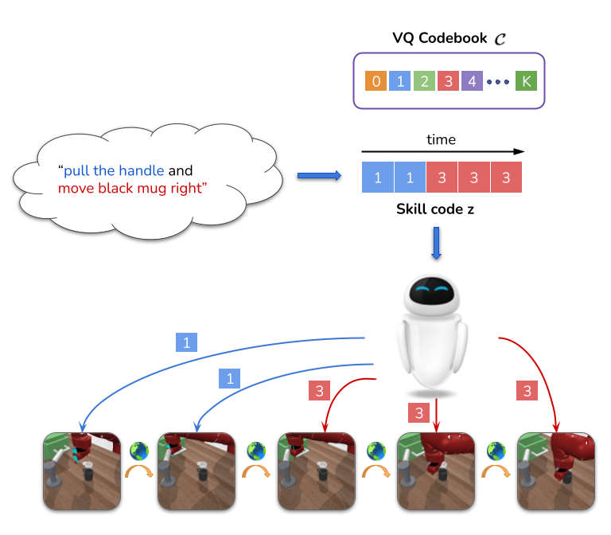
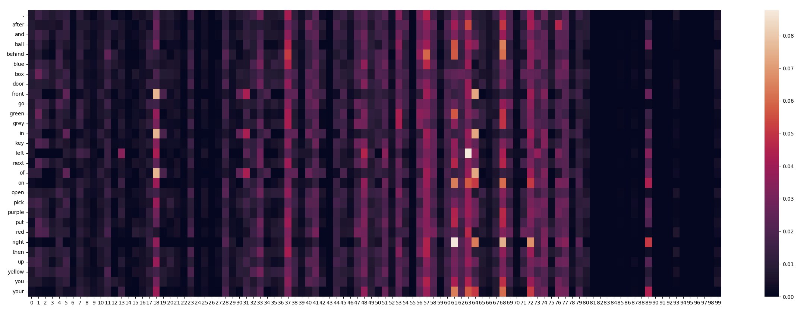

# [LISA](div99.github.io/LISA/)
### **(NeurIPS '22) [LISA: Learning Interpretable Skill Abstractions](https://arxiv.org/abs/2203.00054):** A framework for unsupervised skill learning using Imitation.


<p align="center">
<a href="https://div99.github.io/LISA">

</a>
</p>

Learning policies that effectively utilize language instructions in complex, multitask environments is an important problem in imitation learning. While it is possible to condition on the entire language instruction directly, such an approach suffers from generalization issues. To encode complex instructions into skills that can generalize to unseen instructions, we propose **Learning Interpretable Skill Abstractions (LISA)**, *a hierarchical imitation learning framework that can learn diverse, interpretable skills from language-conditioned demonstrations*. 

 In navigation and robotic manipulation environments, LISA outperforms strong non-hierarchical Decision Transformer baselines in the low data regime and is able to compose learned skills to solve tasks containing unseen long-range instructions. **LISA demonstrates a more natural way to condition on language in sequential decision-making problems and achieve interpretable and controllable behavior with the learned skills.**
 
 ### Citation
```
@inproceedings{
    lisa2022,
    title={{LISA}: Learning Interpretable Skill Abstractions from Language},
    author={Divyansh Garg and Skanda Vaidyanath and Kuno Kim and Jiaming Song and Stefano Ermon},
    booktitle={Advances in Neural Information Processing Systems},
    editor={Alice H. Oh and Alekh Agarwal and Danielle Belgrave and Kyunghyun Cho},
    year={2022},
    url={https://openreview.net/forum?id=XZhipvOUBB}
    }
```

## Code

To install and use LISA check the instructions provided in the [lisa](lisa) folder.

## Learnt Skills
Skill heatmap showing the corresponding word frequencies for each learned skill code from 0-99 on BabyAI BossLevel task.



Skill word clouds showing the words correlated to independent skills learned by LISA on the LORL benchmark.


## Questions
Please feel free to email us if you have any questions. 

Div Garg ([divgarg@stanford.edu](mailto:divgarg@stanford.edu?subject=[GitHub]%LISA)), Skanda Vaidyanath ([svaidyan@stanford.edu](mailto:svaidyan@stanford.edu?subject=[GitHub]%LISA))

