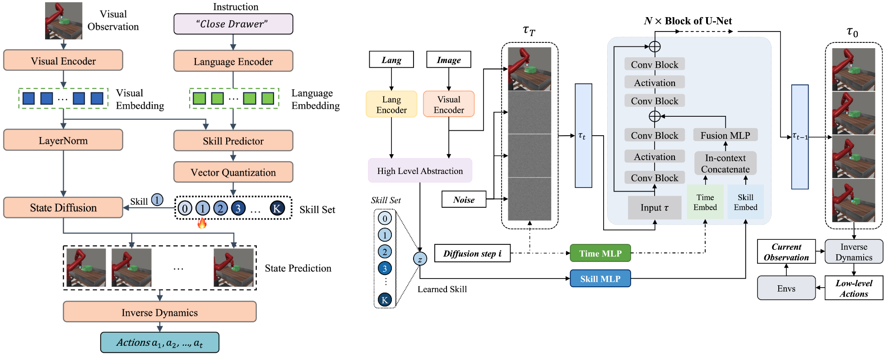

# SkillDiffuser on Compositional Tasks for LOReL Sawyer Robot

This is the official PyTorch implementation of paper:

> ### [SkillDiffuser: Interpretable Hierarchical Planning via Skill Abstractions in Diffusion-Based Task Execution](https://arxiv.org/abs/2312.11598)
> Zhixuan Liang, Yao Mu, Hengbo Ma, Masayoshi Tomizuka, Mingyu Ding, Ping Luo
> 
> CVPR 2024
> 
> [Project Page](https://skilldiffuser.github.io/) | [Paper](https://arxiv.org/abs/2312.11598)

### Framework of SkillDiffuser



SkillDiffuser is a hierarchical planning model that leverages the cooperation of interpretable skill abstractions at the higher level and a skill conditioned diffusion model at the lower level for task execution in a multi-task learning environment. The high-level skill abstraction is achieved through a skill predictor and a vector quantization operation, generating sub-goals (skill set) that the diffusion model employs to determine the appropriate future states. Future states are converted to actions using an inverse dynamics model. This unique fusion enables a consistent underlying planner across different tasks, with the variation only in the inverse dynamics model.

### Citation

```bibtex
@article{liang2023skilldiffuser,
  title={Skilldiffuser: Interpretable hierarchical planning via skill abstractions in diffusion-based task execution},
  author={Liang, Zhixuan and Mu, Yao and Ma, Hengbo and Tomizuka, Masayoshi and Ding, Mingyu and Luo, Ping},
  journal={arXiv preprint arXiv:2312.11598},
  year={2023}
}
```

### Code

To install and use SkillDiffuser check the instructions provided in the [skilldiffuser](skilldiffuser) folder.


### Acknowledgements

The diffusion model implementation is based on Michael Janner's [diffuser](https://github.com/jannerm/diffuser) repo.
The organization of this repo and remote launcher is based on the [LISA](https://github.com/Div99/LISA) repo.

### Questions
Please email us if you have any questions.

Zhixuan Liang ([liangzx@connect.hku.hk](mailto:liangzx@connect.hku.hk?subject=[GitHub]%skilldiffuser))

